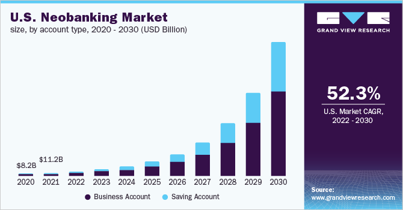
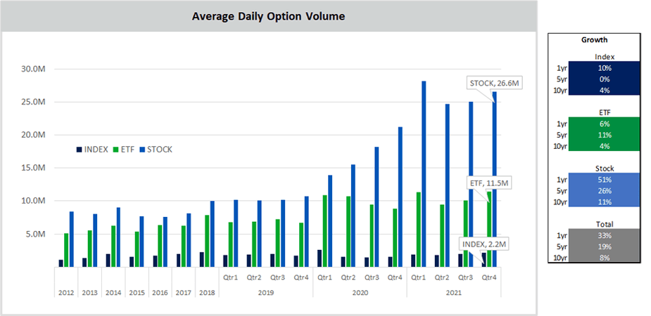

# Module1_Challenge_FinTech_Case_Study

# Global Finance In the Palm of Your Hand

## Overview and Origin
***
### ***What is the name of the company?***
DriveWealth, LLC

### ***When was the company incorporated?***
2012

### ***Who are the founders of the company?***
Bob Cortwright & Julie Coin

### ***How did the idea for the company (or project) come about?***
Founder Bob Cortwright had held high-level positions at Wall Street firms and subsequently moved into the entrepreneurial space starting both FX Soultions, LLC; a currency trading business and Financial Labs, LLC; a high frequency prop trading firm.  Both endeavors realized success with Financial Labs LLC attaining profitability within its first year and subsequently be being purchased by Bank of America.  These ventures led Bob to believe that prosperity is not a zero sum game and to develop and work on a project that pulled together financial knowledge, creativity and cutting edge technology. A vision of a way to create wealth that is globally accessible to everyone, from single DIY investors to broker/dealers and banks came about with DriveWealth, LLC

### ***How is the company funded? How much funding have they received?***
The company has obtained funding through traditional rounds of capital funding.  They have raised a total of $550.8M with the latest funding in Series D round that was completed in August 2021. 

## Business Activities
***
### ***What specific financial problem is the company or project trying to solve?***
A single stop for customers and clients to be able to globally get advice, invest and manage their money fractionally in a variety of accounts types right at your fingertips. The platform DriveWealth LLC has developed can be customizable to the end user depending on the needs and goals of the customer. “Our technology enables our partners to let their consumers trade anything, anytime, from anywhere.” (drivewealth.com) First, the platform offers customers the ability to trade in micro shares or fractionally trade the markets in multiple currencies as well as have access to crypto & tokens based trading. In the portfolio space, customers can create traditional advisor type portfolios that can be automatically rebalanced, as well as full model driven robo-advisor based portfolios. The technology can also allow companies to reward customers with fractional shares of a publicly traded equity in a loyalty app or credit card.  Finally, the company has taken its complete solution fractional investing and trading approach to the health insurance industry and has integrated it into HSA accounts.

### ***Who is the company's intended customer?  Is there any information about the market size of this set of customers?***
DriveWealth’s customers touch a multitude of markets including neobanks (current customer - Flink), digital wallets (current customer - CashApp Block Inc) online loan companies (current customer - MoneyLoin), financial management companies (current customer - Digit), health insurance companies (current customer - MotivHealth), financial education firms (current customer - Alinea) & software (current customer - Templum).  As can be easily noted, DriveWealth LLC’s customers fall into a wide and diverse array of different markets. To examine one specific market size, neobanking, grandviewresearch.com indicated that the global neobanking market size was valued at USD 47.39 billion in 2021 and is expected to grow at a compound annual growth rate (CAGR) of 53.4% from 2022 to 2030 as seen in the below graph from (https://www.grandviewresearch.com/industry-analysis/neobanking-market) 

### ***What solution does this company offer that their competitors do not or cannot offer? (What is the unfair advantage they utilize?)***
The solution that DriveWealth LLC offers that is core to all branches of its business is its proprietary patented Fracker technology.  This is the driver behind the ability to allow a customer to own fractional shares and build portfolios in a multitude of account spaces.  This technology can be implemented in a brokerage account, in saving for retirement and in health care savings accounts.

### ***Which technologies are they currently using, and how are they implementing them?***
DriveWealth utilizes proprietary API’s in their technology of fractional investing 

## Landscape
***
### ***What domain of the financial industry is the company in?
DriveWealth touches a number of FinTech domains but most significantly would be in the personal finance & trading along with digital banking.

### What have been the major trends and innovations of this domain over the last 5–10 years?
The major trends and changes in this realm revolve around taking financial transactions from a time intensive person to person action to electronic and digital transactions that occur seemingly instantaneously from a mobile device.

### What are the other major companies in this domain?
Some of the other companies in this space and are considered DriveWealth’s competitors are Alpaca, Staircase, PerPay and RenoFi.

## Results
***
### What has been the business impact of this company so far?
The business impact thus far can be characterized as rapid,  innovative and positive. DriveWealth is viewed as an industry pioneer in fractional shares trading and in November 2022 was named to Deloitte’s Technology Fast 500 list.  This list is in its 28th year and describes it award winners as “innovative technology companies that redefine the cutting edge and disrupt the technology industry” (https://www2.deloitte.com/us/en/pages/technology-media-and-telecommunications/articles/fast500-winners.html)

### What are some of the core metrics that companies in this domain use to measure success? How is your company performing, based on these metrics?
Some core metrics used to measure success for the company are funding, valuation customer & revenue growth, International growth and headcount expansion.

### How is your company performing relative to competitors in the same domain?
DriveWealth is performing extremely well in this space as compared to competitors, it has completed 5 rounds of funding totaling $550.8M. Some notable investors in recent funding rounds include : Point72 Ventures, Citi Ventures and Fidelity International (https://www.crunchbase.com/organization/drivewealth/company_financials).  Regarding valuation and user numbers, Forbes recently noted that “The number of people trading with DriveWealth's software climbed from 7.2 million to 15 million last year, and the company's valuation jumped more than 10x.” The valuation currently sits at $2.85billion. (https://www.forbes.com/companies/drivewealth/?sh=62f74b9e508d). Furthermore, businesswire.com reported in May 2022 that DriveWealth had “a transformational year where the company realized a 100% growth in customers and revenue, 140% growth of its international business, and an over 150% increase in headcount in 2021.” (https://www.businesswire.com/news/home/20220510005940/en/Fintech-Unicorn-DriveWealth-Appoints-New-Global-CEO-Following-Rapid-Global-Expansion-and-Customer-Growth)

## Recommendations
***
### If you were to advise the company, what products or services would you suggest they offer? (This could be something that a competitor offers, or use your imagination!)
The main advice that  would provide would be to expand its fraction offerings.  Currently it only looks as if stocks and crypto are offered. I would recommend offering a full suite of products to customers including options, futures, mutual funds and bonds.

### Why do you think that offering this product or service would benefit the company?
Giving the customer more available products should attract more customers to use the platform and generate more revenue per customer as transaction volume increases. Furthermore, alternative products to traditional stocks are seeing a substantial increase in volume in the past few years.  Specifically with options, sekingalpha.com posted the following chart which shows the large increase in single stock daily option volume in the past three years:(https://seekingalpha.com/article/4494087-option-flow-2021-retail-rising)

### What technologies would this additional product or service utilize?
Initial thought is that the expansion into additional product offerings mentioned previously would not require additional new technologies but just an adaptation of existing API’s 

## References
***
### Below are the reference web pages used in this case study:
https://www.drivewealth.com/
https://www.crunchbase.com/organization/drivewealth/company_financials
https://www.similarweb.com/website/drivewealth.com/#overview
https://www.businesswire.com/news/home/20220510005940/en/Fintech-Unicorn-DriveWealth-Appoints-New-Global-CEO-Following-Rapid-Global-Expansion-and-Customer-Growth
https://pitchbook.com/profiles/company/58659-49#overview
https://www.prnewswire.com/news-releases/first-dollar-and-drivewealth-partner-to-power-embedded-investing-301622163.html
https://www.grandviewresearch.com/industry-analysis/neobanking-market
https://www2.deloitte.com/us/en/pages/technology-media-and-telecommunications/articles/fast500-winners.html
https://www.forbes.com/companies/drivewealth/?sh=62f74b9e508d
https://seekingalpha.com/article/4494087-option-flow-2021-retail-rising

[def]: images/options_volume.png